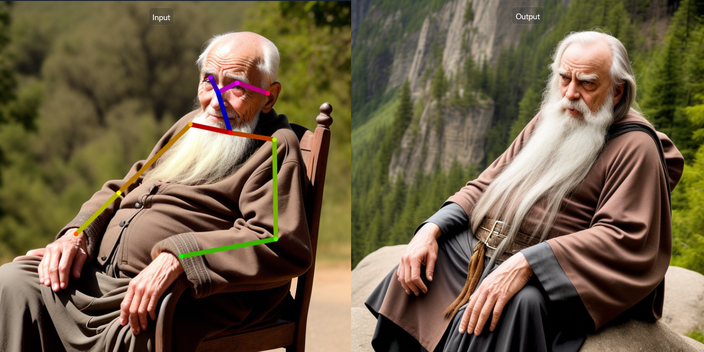
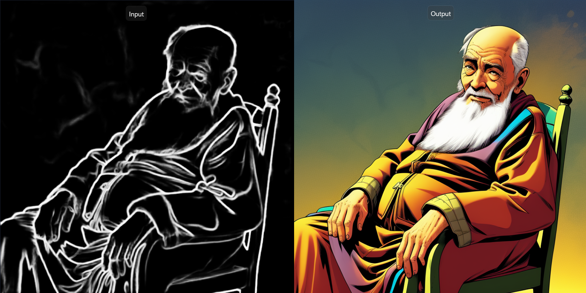

## Introduction

This repository contains a **fully C++ implementation of Stable Diffusion**-based image synthesis, including the original txt2img, img2img and inpainting capabilities and the safety checker. This solution **does not depend on Python** and **runs the entire image generation process in a single process with competitive performance**, making deployments significantly simpler and smaller, essentially consisting a few executable and library files, and the model weights. Using the library it is possible to integrate Stable Diffusion into almost any application - as long as it can import C++ or C functions, but it is **most useful for the developers of realtime graphics applications and games**, which are often realized with C++.

<table style="margin: 0px auto;">
  <tr>
    <td></td>
    <td></td>
    <td></td>
  </tr>
</table>

## ControlNet support

The library also supports ControlNet, this allows using input images to guide the image generation process, for example:

In this first, example we use an OpenPose estimator and OpenPose conditioned ControlNet, we can guide the img2img generation by specifying the pose, so it produces better results.

Using HED edge detection and edge conditioned ControlNet, we change the style of the image to resemble a comic book illustration, but keep the layout intact.

Using a depth estimator and depth map conditioned ControlNet, we generate a different character, but keep the original setup.

## Feature extractors

The library also provides GPU accelerated implementations of the following feature extractors (showcased above):
- Pose estimation: extracts the skeleton of a human from an image using [OpenPose](https://arxiv.org/abs/1812.08008)
- Depth estimation: estimates the depth of each pixel from a single image using [MiDAS](https://arxiv.org/abs/1907.01341v3)
- Edge Detection: extracts edges from an image, using [Holistically-Nested Edge Detection](https://arxiv.org/abs/1504.06375)

## Reference models

The AI models required for the library are stored in the ONNX format. All of the models have been run through Microsoft Olive and are optimized for DirectML. I have tested the library with the following models:

- [Stable Diffusion 1.5 with ControlNet support](https://huggingface.co/axodoxian/stable_diffusion_onnx)
- [Realistic Vision 1.4 with ControlNet support](https://huggingface.co/axodoxian/realistic_vision_onnx)
- [ControlNet with feature extractors](https://huggingface.co/axodoxian/controlnet_onnx)

You may bring your own models, by converting them using [this guide](https://github.com/axodox/unpaint/wiki/Model-import).

> Please make sure to check the original license of the models if you plan to integrate them in your products.

## Technical background

The implementation uses the [ONNX](https://onnx.ai/) to store the mathematical models involved in the image generation. These ONNX models are then executed using the [ONNX runtime](https://github.com/microsoft/onnxruntime), which support a variety of platforms (Windows, Linux, MacOS, Android, iOS, WebAssembly etc.), and execution providers (such as NVIDIA CUDA / TensorRT; AMD ROCm, Apple CoreML, Qualcomm QNN, Microsoft DirectML and many more). 

We provide an example integration called [Unpaint](https://github.com/axodox/unpaint) which showcases how the libraries can be integrated in a simple WinUI based user interface. You may download a recent release from [here](https://github.com/axodox/unpaint/releases) to evaluate the performance characteristics of the solution. 

> Please note that you will need to install the provided test certificate to run the example app into your Trusted Root Certificate Authorities Store (in the local machine container), you can also [resign the package with your own certificate](https://learn.microsoft.com/en-us/windows/msix/package/create-certificate-package-signing) to make it install.

The current codebase and the resulting [Nuget packages](https://www.nuget.org/packages/Axodox.MachineLearning) target Windows and use DirectML, however only small sections of the code utilize Windows specific APIs, and thus could be ported to other platforms with minimal effort.

## Licensing

The source code of this library is provided under the MIT license.

## Integrating the component

Prebuilt versions of the project can be retrieved from Nuget under the name `Axodox.MachineLearning` and added to Visual Studio C++ projects (both desktop and UWP projects are supported) with the x64 platform.

Basic integration:
- Add the `Axodox.Common` and `Axodox.MachineLearning` packages to your project
- Make sure to **only have x64 platform in your project** as this lib is x64 only for now
- Ensure that your compiler is set to **C++20**, we also recommend enabling all warnings and conformance mode
- Add the following include statement to your code file or precompiled header: `#include "Include/Axodox.MachineLearning.h"`
- Follow this example code to integrate the pipeline: https://github.com/axodox/unpaint/blob/main/Unpaint/StableDiffusionModelExecutor.cpp

> We recommend adding appropriate safety mechanisms to your app to suppress inappropriate outputs of StableDiffusion, the performance overhead is insignificant.

The Stable Diffusion models we use have been generated using [Microsoft Olive](https://github.com/microsoft/Olive/tree/main/examples/directml/stable_diffusion), please follow the linked example to convert models from HuggingFace. By changing the script you can also convert models stored on your disk from various formats (e.g. `*.safetensors`). You can find some preconverted models [here](https://huggingface.co/models?other=unpaint,stable_diffusion_model) for testing.

# Building the project

Building the library is required to make and test changes. You will need to have the following installed to build the library:

- [Visual Studio 2022](https://visualstudio.microsoft.com/downloads/)
  - Select the following workloads:
    - Desktop development with C++    
    - Game development with C++
  - To build [Unpaint](https://github.com/axodox/unpaint) as well also select these individual packages:
    - Universal Windows Platform development
    - C++ (v143) Universal Windows Platform tools

You can either run `build_nuget.ps1` or open `Axodox.MachineLearning.sln` and build from Visual Studio.

Once you have built the library, you override your existing nuget package install by setting the `AxodoxMachineLearning-Location` environment variable to point to your local build. 

> For example `C:\dev\axodox-machinelearning\Axodox.MachineLearning.Universal` for an UWP app and `C:\dev\axodox-machinelearning\Axodox.MachineLearning.Desktop` for a desktop app.

Then add the project pointed by the path to the solution of your own project. This allows to add all projects into the same solution and make changes on the library and your app seamlessly without copying files repeatedly.
